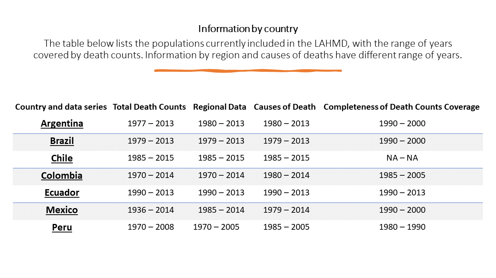

# Latin America Human Mortality Database
The web-site aims at disseminating human mortality data and literature of human mortality in Latin America, in order to provide detailed information for researchers, students, policy makers and the general public interested in knowing trends and developments in the study of mortality in the region. The project is inspired by The Human Mortality Database (www.mortality.org) and is the result of joint work of Prof. B. Urdinola of the National University of Colombia, Bogota Department of Statistics and Professor Bernardo Lanza Queiroz Depto of Demography and CEDEPLAR, UFMG, Belo Horizonte-Brazil. The project now is funded by our own resources. In the past, we received funding from the Population Association of America (www.popassoc.org) and the Research Direction of  Universidad Nacional de Colombia-Bogotá (DIB www.dib.unal.edu.co).  At present the database contains detailed information on mortality for seven countries in Latin America: Argentina, Brazil, Colombia, Chile, Ecuador, Mexico and Peru. All information is broken down by age, sex, region and cause of death. Additionally there is information on the academic literature on the study of mortality for these same countries.

  

## Information about data
We provide basic mortality data for seven (7) Latin American countries. We did not perform any adjustment in the data. That is, raw data are available and should be treated properly by researchers. Please, note that the structure of the data varies for country and year. We did not try to harmonize the data, over time and by country, in order to have the longest period of information as possible. Mortality data is known for its limitations: errors in age declaration, under-registration of death counts and others. Users should be aware of such limitations. Please bear in mind that the web-site is always under construction.

## Data availability

  

## Country Data
Tables include what is described in their titles in excel format. Country level data, death counts and population, are also avalaible in TXT format for Argentina, Brazil, Colombia and Peru. For each excel file you will find different tabs corresponding to a particular year. For instance, death records by age, sex and province for Peru are found under the sub-title Peru in our link “Country Data”. After you click in PER, Deaths by age, sex and region the table with the data will open-up and each tab is named with the information for the corresponding year.

## Argentina
<li><a href="https://github.com/lamortalidad/lamortalidad.github.io/blob/68ec3005ee377c4aca20a3d3f7d22309707ebe81/data/Argentina_Deaths.txt"> Total Death Counts, by age and sex </a></li>

<li><a href="https://github.com/lamortalidad/lamortalidad.github.io/blob/ba0c79f889ef1c99a59484a14ad180ad16bfd966/data/Argentina_Population.txt"> Population, by age and sex </a></li>

<li><a href="https://github.com/lamortalidad/lamortalidad.github.io/blob/e007bd3f68f05e1f33b6cd7d38adbef6170f1a5b/data/SEX-AGE_ARG.xlsx"> Death Counts, by age and sex </a></li>

<li><a href="https://github.com/lamortalidad/lamortalidad.github.io/blob/ed4e8c2402cd5a3542f962d3640ffb9fec8ce3de/data/SEX-AGE-REGION-CAUSE-ARG.xlsx"> Death Counts, by age, sex, causes of death and regions </a></li>

## Brazil 

<li><a href="https://github.com/lamortalidad/lamortalidad.github.io/blob/be3509a5fed0210d0e8bc2429038e08e52c568d8/data/Brazil_Deaths.txt"> Total Death Counts, by age and sex </a></li>

<li><a href="https://github.com/lamortalidad/lamortalidad.github.io/blob/51a7e0da3ec7bac814d7d69e0e79cf204d0d405c/data/Brazil_Population.txt"> Population, by age and sex </a></li>

## Colombia

<li><a href="https://github.com/lamortalidad/lamortalidad.github.io/blob/e4e24230d296e2a5d2f6e93f797df17d5c5ccf9b/data/Colombia_Deaths.txt"> Total Death Counts, by age and sex </a></li>

<li><a href="https://github.com/lamortalidad/lamortalidad.github.io/blob/aa6f98a24caf96f3aa18e1d9ae73f4b210e9a555/data/Colombia_Population.txt"> Population, by age and sex </a></li>

## Chile

<li><a href="https://github.com/lamortalidad/lamortalidad.github.io/blob/cc1a9f50fbe04c5804f73b5d611ea770a05d35af/data/SEX-AGE-CHI.xlsx"> Death Counts, by age and sex </a></li>

<li><a href="https://github.com/lamortalidad/lamortalidad.github.io/blob/4da49a27f296e8295d055d4f9ac939b0f3bd191e/data/SEX-AGE-REGIONS-CAUSE_CHI.xlsx"> Death Counts, by age, sex, causes of death and regions </a></li>

## Ecuador

<li><a href="https://github.com/lamortalidad/lamortalidad.github.io/blob/59bf28ea997972c2f104dfe0b764c053d5443704/data/SEX-AGE_ECU.xlsx"> Death Counts, by age and sex </a></li>

<li><a href="https://github.com/lamortalidad/lamortalidad.github.io/blob/f46cf0075deda8c249df7706c99cb42143ab32b8/data/SEX-AGE-REGION-_-CAUSE_ECU.xlsx"> Death Counts, by age, sex, causes of death and regions </a></li>

## Mexico 

<li><a href="https://github.com/lamortalidad/lamortalidad.github.io/blob/6b7115eac9c4bda383bbe889ba0ee9cb2b59d844/data/Mexico_Deaths.txt"> Total Death Counts, by age and sex </a></li>

<li><a href="https://github.com/lamortalidad/lamortalidad.github.io/blob/e2155fcf9ea7f86db81613c9e0139ed09472685a/data/Mexico_Population.txt"> Population, by age and sex  </a></li>

## Peru

<li><a href="https://github.com/lamortalidad/lamortalidad.github.io/blob/970d440867a6d142d44f1820b6a7fb7d85d73db9/data/Peru_Deaths.txt"> Total Death Counts, by age and sex </a></li>

<li><a href="https://github.com/lamortalidad/lamortalidad.github.io/blob/432cf68df8c58b8cf9d270e0c7268ae73750d627/data/Peru_Population.txt"> Population, by age and sex  </a></li>

# Citations Guideline and Conditions

The Latin America Human Mortality Database (LAHMD) is provided free of charge. Users are asked to read carefully the following conditions.

It is the responsibility of all users of the LAHMD to give proper credit to the institutions and/or individuals who have created the data being provided or transmitted here. Proper citation is necessary whether the data in question are quoted in formal publications or in any other context. The following comments are intended to assist users by providing information about LAHMD data sources and by offering suggestions for appropriate citation procedures.

If you are using our original mortality data by either combination of age, sex, region and/or causes of death, we suggest the following format for a bibliographic citation (please do always cite with the English version name, for uniformity):

Latin American Human Mortality Database. B. Piedad Urdinola and Bernardo L. Queiroz . Available at lamortalidad.github.io (data downloaded on [date]).

Data available on the LAHMD may be provided by external sources, such as World Health Organization, United Nations Population Division and National Statistics Offices. In situations where data come from external sources, the user should identify and cite the original source, merely acknowledging the LAHMD as the intermediary.

Users are also asked not to distribute downloaded data to other individuals. Instead, refer them to the LAHMD web site, where they can download the data by themselves. Since the database will be updated on regular basis, this practice will favour the acquisition of up-to-date data. It will also ensure that each user has complete access to information regarding the data, citation guidelines, etc.

We have been very careful in assembling and manipulating the data presented here and we would appreciate your help in identifying and reporting any inaccuracies. The members of the LAHMD research team, as well as the institutional sponsors, accept no liability in regards to the material available in the collection. In particular, we do not accept responsibility for any inconvenience that may result in using these data, even if such inconvenience is caused by our own error.

We intend to update the LAHMD on regular basis and to provide convenient access to the data via the Internet. However, we do not accept responsibility for any inconvenience that may result from a temporary or permanent suspension of service.

It should be noted that these data are transmitted on the understanding that no use will be made of them for commercial purposes and that no such permission or right to use may be implied thereby..

Please, send any comments, suggestions to lamortalidade@gmail.com

Note: The text above has been adapted from the Canadian Human Mortality Database (http://www.bdlc.umontreal.ca/chmd/), the Human Mortality Database web site (www.mortality.org) and WHO Mortality Database website (http://www.who.int/healthinfo/morttables/en/) .

## Acknowledgments

We want to thank Dirección de Estadísticas de Información de Salud de Argentina from Ministry of Health for providing death records information for Argentina, particularly to Carlos Guevel. We thank Bernardo Guerrero, Dirección de Censos y Demografía at DANE for providing death records information for Colombia for 1979-2010. Also grateful with Byron Villacís who provided mortality data for Ecuador.

We specially thank the collaboration of our great Research Assistants. For the data corresponding to Argentina, Colombia, Peru and Chile we thank Natalia Rojas Perilla, Adriana Rocío Reyes, William García, Andrés N. López and Luz Valerie Pascal. Mario Piscoya for helping us with Peruvian data, also Ursula Mattioli and Matheus Lobo Alves Ferreira for research assistance.We also thank Fasecolda that provided the time for Diana P. Guarín to help us process data for Colombia. Similarly, we are thankful to Andres Barajas who donated his time to process the latest years for Mexico.

