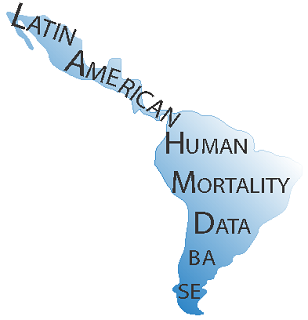

# Latin America Human Mortality Database
The web-site aims at disseminating human mortality data and literature of human mortality in Latin America, in order to provide detailed information for researchers, students, policy makers and the general public interested in knowing trends and developments in the study of mortality in the region. The project is inspired by The Human Mortality Database (www.mortality.org) and is the result of joint work of Prof. B. Urdinola of the National University of Colombia, Bogota Department of Statistics and Professor Bernardo Lanza Queiroz CEDEPLAR, Belo Horizonte-Brazil, funded by the Population Association of America (www.popassoc.org) and the Research Direction of  Universidad Nacional de Colombia-Bogotá (DIB www.dib.unal.edu.co). At present the database contains detailed information on mortality for seven countries in Latin America: Argentina, Brazil, Colombia, Chile, Ecuador, Mexico and Peru. All information is broken down by age, sex, region and cause of death. Additionally there is information on the academic literature on the study of mortality for these same countries.

  

## Country Data
Tables include what is described in their titles in excel format. For each excel file you will find different tabs corresponding to a particular year. For instance, death records by age, sex and province for Peru are found under the sub-title Peru in our link “Country Data”. After you click in PER, Deaths by age, sex and region the table with the data will open-up and each tab is named with the information for the corresponding year.

## Argentina

